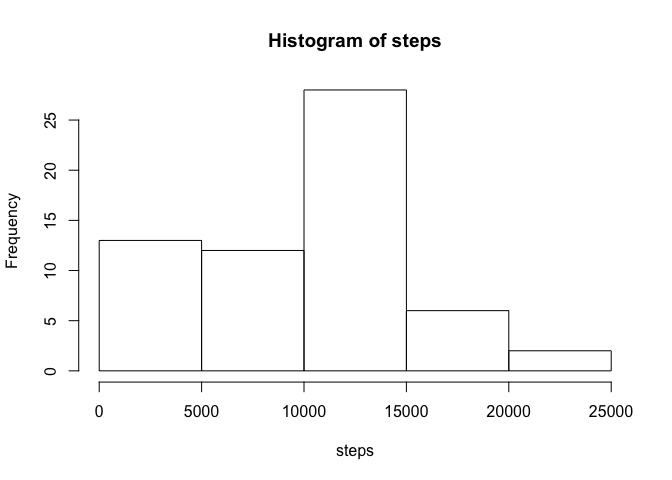
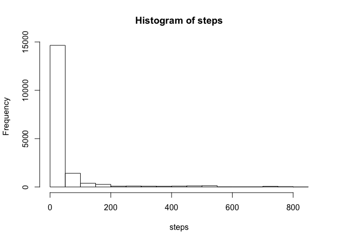
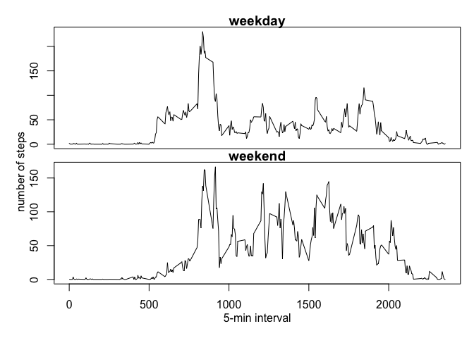

## Loading and preprocessing the data
Since we cloned the assignment Git repo I simply unzipped the data file from there
and assigned it to the activity variable. I also changed the date column format.

```r
setwd("~/Documents/Coursera Data Science JH/C5/W2/RepData_PeerAssessment1")
unzip(zipfile = "activity.zip")
activity <- read.csv("activity.csv")
activity$date <- as.Date(activity$date)
library(tidyverse)
```

## What is mean total number of steps taken per day?
First I grouped the data by date, and created a histogram of the total number of 
steps taken per day.

```r
q1activity <- activity%>%
        select(-interval)%>%
        group_by(date)%>%
        summarize_all(sum, na.rm = TRUE)

with(q1activity, hist(steps))
```

<!-- -->

Then using the same data grouping I was able to calculate the Mean and Median values.

```r
q1mean <- q1activity%>%
        select(steps)%>%
        summarize_all(mean)

q1median <- q1activity%>%
        select(steps)%>%
        summarize_all(median)

print(q1mean)
```

```
## # A tibble: 1 x 1
##   steps
##   <dbl>
## 1 9354.
```

```r
print(q1median)
```

```
## # A tibble: 1 x 1
##   steps
##   <int>
## 1 10395
```
We can see from this that the mean=9354, and the median=10394

## What is the average daily activity pattern?
To show the pattern of daily activity over each interval, I grouped the data by 
intervals, and created another histogram of this data.  

```r
q2activity <- activity%>%
        select(-date)%>%
        group_by(interval)%>%
        summarize_all(mean, na.rm=TRUE)

plot(q2activity, type="l")
```

<!-- -->
  
Using this data I was able to find the interval with the maximum average number of steps  

```r
q2max <- q2activity%>%
        arrange(desc(steps))
      
q2max <- q2max[1,]

print(q2max)
```

```
## # A tibble: 1 x 2
##   interval steps
##      <int> <dbl>
## 1      835  206.
```
  We can see from this output that the interval with the highest average number of steps was interval 835, with 206.17 steps.
  
## Imputing missing values
I counted the number of missing values, and found there to be 2304 NA values.

```r
NAcount<- is.na(activity)
table(NAcount)
```

```
## NAcount
## FALSE  TRUE 
## 50400  2304
```
To impute data for the missing values, I decided to use the average number of steps for each interval. I then assigned those average values to any of the NA values. The new dataset was called 'noNAs'.

```r
intervalaverages <- activity%>%
  group_by(interval)%>%
  mutate(interval.average= mean(steps, na.rm=TRUE))

noNAs <- activity
noNAs$steps[is.na(noNAs$steps)] <- intervalaverages$interval.average[is.na(intervalaverages$steps)]
```
We can see below that replacing the NA values has a dramatic effect on the histogram 
of total steps, and the Mean and Median values.

```r
#Histogram
with(noNAs, hist(steps))
```

<!-- -->

```r
#Mean and Median Values
noNAs.mean <- noNAs%>%
  select(steps)%>%
  summarize_all(mean)

noNAs.median <- noNAs%>%
  select(steps)%>%
  summarize_all(median)

print(noNAs.mean)
```

```
##     steps
## 1 37.3826
```

```r
print(noNAs.median)
```

```
##   steps
## 1     0
```
After replacing the missing values the mean=37.38, and the median=0
## Are there differences in activity patterns between weekdays and weekends?
To visualize any differences between weekend and weekday activity patterns, I subsetted the data 
into 2 separate dataframes and plotted each one against each other. The plots show that 
on the weekends there was much higher acitvity in the middle of the day and afternoon.

```r
q4data <- noNAs
weekenddays <- c("Saturday", "Sunday")

q4data$day.type <- factor(weekdays(q4data$date) %in% weekenddays, levels = c(FALSE, TRUE), labels=c("weekday", "weekend"))

weekday <- q4data%>%
  filter(day.type=="weekday")%>%
  select(interval, steps)%>%
  group_by(interval)%>%
  summarize_all(mean, na.rm=TRUE)

weekend <- q4data%>%
  filter(day.type=="weekend")%>%
  select(interval, steps)%>%
  group_by(interval)%>%
  summarize_all(mean, na.rm=TRUE)

par(mfrow=c(2,1))
par(mar = c(0, 0, 1, 0), oma = c(4, 4, 1, 1))
plot(weekday, type="l", xaxt='n', main="weekday")
plot(weekend, type="l", main="weekend", xlab="5-min interval", ylab="number of steps")
mtext(side=1, line=2, "5-min interval")
mtext(side=2, line=2, "                                 number of steps")
```

<!-- -->
